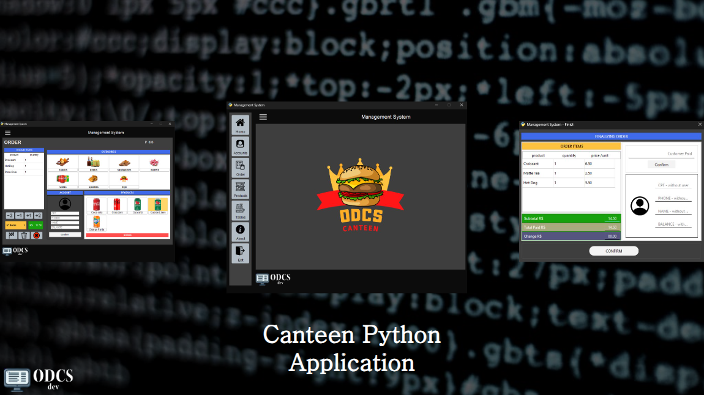

# Canteen Management Application



<br><br>

This project was developed after just a few months of contact with the world of programming, and the goal was to put into practice the theoretical knowledge and exercises related to Python language and SqlServer database.


<ul>
    <li>In Python language, the following knowledge was applied:
        <ol>
            <li>Programming logic</li>
            <li>List and dictionary manipulation</li>
            <li>Object-oriented programming</li>
            <li>Exception handling</li>
        </ol>
    </li>
    <li>In the database:
        <ol>
            <li>Data modeling</li>
            <li>Entity Relationship Modeling (ERM)</li>
            <li>Entity Relationship Diagram (ERD)</li>
            <li>Normalization</li>
            <li>Data dictionary</li>
            <li>DML and DDL</li>
        </ol>
    </li>
</ul>
<br><br>

---
## Usage
Follow the steps to run the application on your local machine.


1. Clone the repository:
    ```
    git clone https://github.com/ODCS1/Canteen-Management.git
    ```
2. Now make sure you have SqlServer and SSMS (Sql Server Management Studio) installed on your machine.
    [Official Site](https://www.microsoft.com/pt-br/sql-server/sql-server-downloads?msockid=098e3ce9451060e323b429eb44c16141)
3. With SSMS open, execute the commands contained in the script.sql file.
4. Create a login with Sql Server authentication and grant modification access to the data in the Canteen database previously created.
5. Now, in the terminal, change the directory:
    ```
    cd Canteen-Management/src
    ```
3. Make sure Python is installed:
    ```
    python --version
    ```
4. Install Dependencies:
    ```
    pip install pyside6 pyodbc
5. Run main.py:
    ```
    python main.py
    ```

---

⚡ Thank you for visiting my Repository! If you like what you saw, please star it and follow me to see more interesting projects coming soon.
